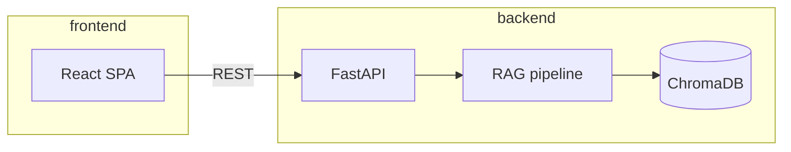

# Travel Agency RAG Concierge

MVP for a travel agency: **RAG** over internal documents, **structured answers** (links + related services), escalation routing, and a **React** chat UI that talks to a separate **FastAPI** backend.

## Repository layout

| Path | Role |
|------|------|
| `backend/` | FastAPI JSON API, ingestion, ChromaDB, OpenAI |
| `frontend/` | Vite + React + TypeScript chat client |
| `data/` | PDFs, FAQs, and guides to index |
| `.env` (repo root, gitignored) | Secrets and configuration |

## Backend

**1.** Python 3.10+ and a virtualenv at the repo root (or anywhere you prefer):

```powershell
cd D:\github\travel_chatbot
python -m venv .venv
.\.venv\Scripts\Activate.ps1
pip install -r backend\requirements.txt
```

**2.** From the repo root, copy `.env.example` → `.env` and set `OPENAI_API_KEY`. Keep real keys out of git.

**3.** Build the vector index (run with `backend` as current directory so `python -m app` resolves):

```powershell
cd backend
python -m app.ingest
```

**4.** Start the API (localhost only is recommended for dev):

```powershell
cd backend
uvicorn app.main:app --reload --host 127.0.0.1 --port 8000
```

- `GET /api/health` — liveness + chunk count  
- `POST /api/chat` — `{ "message": "...", "session_id": null }`  
Errors return JSON: `{ "error": { "code", "message", "details" } }` with appropriate HTTP status (e.g. `KB_NOT_READY`, `RETRIEVAL_FAILED`, `LLM_UPSTREAM`).

**CORS:** set `CORS_ORIGINS` in `.env` (comma-separated), e.g. `http://localhost:5173,http://127.0.0.1:5173`.

## Frontend

```powershell
cd frontend
npm install
npm run dev
```

Vite defaults to **http://localhost:5173** and **proxies `/api` → http://127.0.0.1:8000**, so you normally do not need `VITE_API_BASE` in dev.

For production builds served separately, set `VITE_API_BASE` to the public API origin (see `frontend/.env.example`).

**Error handling:** the UI uses an **error boundary**, an **alert banner** for API errors, and typed **`ApiError`** parsing for non-OK responses and malformed JSON.

## Architecture



## Security notes

- Never commit `.env` or live API keys. If a key was ever committed to `.env.example` or history, **rotate it** in the provider console.  
- Bind the API to `127.0.0.1` unless you intentionally expose it and add TLS + auth.

## Troubleshooting

**`POST /api/chat` returns 503 (`KB_NOT_READY`).** The vector collection is missing or empty—often because **`python -m app.ingest` did not finish successfully**. On many Windows hosts, local ONNX embeddings fail; set **`OPENAI_API_KEY`** in the repo-root `.env` (recommended), then run `cd backend && python -m app.ingest`. Only set **`ALLOW_LOCAL_ONNX_EMBEDDINGS=true`** if you intentionally use Chroma’s ONNX model and onnxruntime loads on your OS. **`GET /api/health`** includes a **`hint`** when status is `degraded`.

**503 `EMBEDDINGS_NOT_CONFIGURED`.** The API could not create embeddings (usually missing **`OPENAI_API_KEY`**). Set the key and restart the backend; ingest again if the index was never built.
