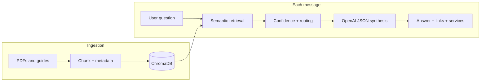

# Travel Agency RAG Concierge

MVP conversational assistant for a travel agency: **retrieval-augmented generation** over your internal PDFs and text guides, **structured replies** (answer + booking link + related services), and **automatic escalation** hints when retrieval is weak or the request needs a human.

## Architecture

- **Ingestion:** PDF / Markdown / TXT / JSON FAQs under [`data/`](data/) → chunk → **ChromaDB** (persistent). Embeddings: **OpenAI** (`text-embedding-3-small` by default) when `OPENAI_API_KEY` is set, otherwise **ONNX MiniLM** locally (no PyTorch).
- **Retrieval:** Top‑k semantic search + distance-based confidence score.
- **Generation:** **OpenAI** chat API with JSON-only output and strict “use only context” instructions.
- **Escalation:** Keyword/heuristic pre-checks, low retrieval confidence, and/or model flag → support URL appended to the answer.
- **Chat UI:** Modern single-page web UI served by FastAPI (`static/`).



## Quick start

**1.** Python 3.10+ recommended.

**2.** Create a virtualenv and install dependencies:

```bash
python -m venv .venv
.\.venv\Scripts\activate
pip install -r requirements.txt
```

**3.** Copy environment template and set your OpenAI key:

```bash
copy .env.example .env
```

Edit `.env` and set `OPENAI_API_KEY` (recommended: the same key drives **chat** and **embeddings**, avoiding local PyTorch/ONNX). Adjust `BOOKING_BASE_URL`, `SUPPORT_CONTACT_URL`, and `SIMILARITY_THRESHOLD` (minimum retrieval “match” score in \[0,1\]) as needed. If you omit the key, ingestion uses **local ONNX** embeddings; on some Windows hosts ONNX DLLs fail—in that case set the key or install the [Visual C++ Redistributable](https://learn.microsoft.com/en-us/cpp/windows/latest-supported-vc-redist).

**4.** Add documents under `data/` (your PDF is already at `data/docs/…`). Then build the vector index:

```bash
python -m app.ingest
```

**5.** Run the API and UI:

```bash
uvicorn app.main:app --reload --host 127.0.0.1 --port 8000
```

Open http://127.0.0.1:8000 — the chat widget loads there. API: `POST /api/chat` with JSON `{"message":"…","session_id":null}`.

## Logging

Conversation turns are appended to `logs/conversations.jsonl` (created automatically).

## Project layout

| Path | Role |
|------|------|
| `app/ingest.py` | Document pipeline → Chroma |
| `app/retrieval.py` | Vector query + passages |
| `app/llm.py` | Prompt + OpenAI JSON response |
| `app/escalation.py` | Routing / escalation heuristics |
| `app/chat_service.py` | Session memory + orchestration |
| `app/main.py` | FastAPI routes |
| `static/` | Chat frontend |

## Production notes (later)

Swap the in-memory session store for Redis or your auth-aware session layer; add auth to `/api/chat`; pin model versions; schedule periodic re-ingestion; wire `SUPPORT_CONTACT_URL` to your CRM or ticketing system.
